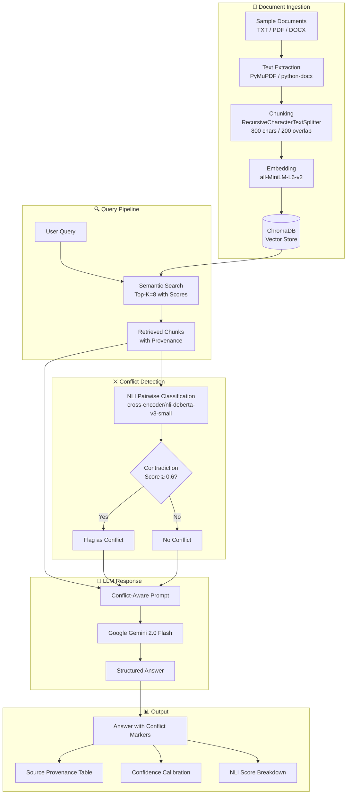

# 🏥 Hospital RAG — Conflict Detection Q&A System

> **Option A — RAG Robustness & Conflict Detection (Document QA)**

A retrieval-augmented generation pipeline for querying hospital performance documents with **automated conflict detection**, **source provenance**, and **confidence calibration**.

---

## 🏗 Architecture



---

## 🔧 Technology Choices

| Component | Technology | Why |
|-----------|-----------|-----|
| **Vector DB** | ChromaDB (local) | Zero infrastructure setup, built-in similarity scores, persistent local storage. Ideal for document sets under 100K chunks. |
| **Embeddings** | all-MiniLM-L6-v2 | Fast (~80ms/doc), lightweight (80MB), strong semantic performance on sentence pairs. |
| **LLM** | Google Gemini 2.0 Flash | Free tier available, fast inference (<2s), excellent instruction following for structured outputs. |
| **Conflict Detection** | cross-encoder/nli-deberta-v3-small | State-of-the-art NLI model. Classifies chunk pairs as entailment/neutral/contradiction. Runs locally — no API cost. |
| **UI** | Streamlit | Rapid prototyping, rich widgets, easy deployment, good for demos. |
| **Framework** | LangChain | Composable chains, document loaders, text splitters, vector store integrations. |

---

## 📁 Project Structure

```
hospital-rag-conflict-detection/
├── app.py                      # Streamlit UI
├── config.py                   # All configuration constants
├── ingestion.py                # Document loading, chunking, embedding
├── retriever.py                # Similarity search with provenance
├── conflict_detector.py        # NLI-based conflict detection
├── rag_pipeline.py             # Main RAG orchestrator
├── requirements.txt            # Python dependencies
├── DESIGN_DOC.md               # Scalability & design decisions
├── README.md                   # This file
├── .streamlit/
│   └── config.toml             # Streamlit theme
├── sample_documents/           # 12 synthetic hospital documents
│   ├── Q1_Patient_Satisfaction_Survey.txt
│   ├── Q1_Emergency_Dept_Report.txt
│   ├── Q1_Surgical_Outcomes_Report.txt
│   ├── Board_Meeting_Minutes_March.txt
│   ├── Q1_Patient_Complaints_Log.txt
│   ├── Nursing_Staff_Report_Q1.txt
│   ├── Q1_Surgical_Complications_Memo.txt
│   ├── Q1_Outpatient_Feedback_Summary.txt
│   ├── Q1_Financial_Summary.txt
│   ├── Staff_Turnover_Report_Q1.txt
│   ├── Q1_Budget_Variance_Report.txt
│   └── Infection_Control_Quarterly.txt
└── data/
    └── chroma_db/              # Generated vector store (auto-created)
```

---

## 📊 Dataset Description

### Source
**Fully synthetic / self-created** — 12 documents simulating a hospital's Q1 2025 performance reports, meeting notes, memos, and logs.

### Document Types
All TXT files (easily verifiable). The system also supports PDF and DOCX ingestion.

### Intentional Conflicts (6+ pairs)

| Conflict | Document A | Document B | Nature |
|----------|-----------|-----------|--------|
| Satisfaction vs Complaints | Patient Satisfaction Survey (+20%) | Patient Complaints Log (+15%) | Overall satisfaction up but complaints also up |
| ED Performance | Board praised improvements | Emergency Dept Report (complaints +25%) | Leadership optimism vs ground-level challenges |
| Surgical Safety | Surgical Outcomes (96.2% success) | Surgical Complications Memo (infections +8%) | Success rate vs complication rate |
| Patient Experience | Satisfaction Survey (+20%) | Outpatient Feedback (-12%) | Inpatient vs outpatient divide |
| Staff Wellbeing | Nursing Report (morale up) | Turnover Report (+33% turnover) | Engagement scores vs actual departures |
| Financial Health | Financial Summary (revenue +12%) | Budget Variance Report ($2.7M overrun) | Revenue growth vs expense overruns |

### Preprocessing
- **Chunking**: `RecursiveCharacterTextSplitter` with 800-char chunks and 200-char overlap
- **Metadata**: Each chunk tagged with `source`, `doc_id`, `department`, `quarter`, `doc_type`, `chunk_id`
- **No cleaning**: Documents are used as-is to preserve realistic formatting

---

## 🚀 Setup & Run Instructions

### Prerequisites
- Python 3.10+
- Google Gemini API key ([get one free](https://aistudio.google.com/))

### Installation

```bash
# Clone the repository
git clone <repo-url>
cd hospital-rag-conflict-detection

# Create virtual environment
python -m venv venv
venv\Scripts\activate        # Windows
# source venv/bin/activate   # macOS/Linux

# Install dependencies
pip install -r requirements.txt
```

### Run the Application

```bash
# Option 1: Run Streamlit app (recommended)
streamlit run app.py

# Option 2: Run ingestion only (pre-index documents)
python ingestion.py
```

### Usage
1. Open the app in your browser (http://localhost:8501)
2. Enter your **Google Gemini API Key** in the sidebar
3. Documents are auto-ingested on first run
4. Type a question or click a demo query
5. Review the answer, detected conflicts, source provenance, and confidence

---

## 🔍 Example Queries & Expected Outputs

### Query 1: "How has patient satisfaction changed over Q1?"

**Expected answer**: Mixed signals — overall survey satisfaction improved ~20%, but complaints increased 15%, ED complaints rose 25%, and outpatient satisfaction dropped 12%.

**Expected conflicts**:
- `Q1_Patient_Satisfaction_Survey.txt` ↔ `Q1_Patient_Complaints_Log.txt`
- `Q1_Patient_Satisfaction_Survey.txt` ↔ `Q1_Outpatient_Feedback_Summary.txt`

**Expected confidence**: Medium (due to detected conflicts)

### Query 2: "What is the state of surgical outcomes this quarter?"

**Expected answer**: Surgical success rate is 96.2% overall, but post-operative infection rates rose 8%, with the infection control officer flagging broader complications beyond SSIs.

**Expected conflicts**:
- `Q1_Surgical_Outcomes_Report.txt` ↔ `Q1_Surgical_Complications_Memo.txt`

**Expected confidence**: Medium

---

## ⚙️ Key Design Decisions

1. **Two-stage conflict detection**: NLI model for fast pairwise classification → LLM for nuanced reasoning. This avoids expensive LLM calls for every pair while catching real contradictions.

2. **Confidence calibration**: Score = f(avg_similarity, max_similarity) - conflict_penalty. Any detected conflict caps confidence at "Medium" regardless of retrieval scores.

3. **Cross-document only**: Conflicts are only flagged between different source documents, not within the same document.

4. **ChromaDB over Pinecone/Weaviate**: Zero infrastructure, no API keys needed for the vector DB, local persistence. For production with >100K docs, we'd switch to Weaviate or Pinecone (see DESIGN_DOC.md).
